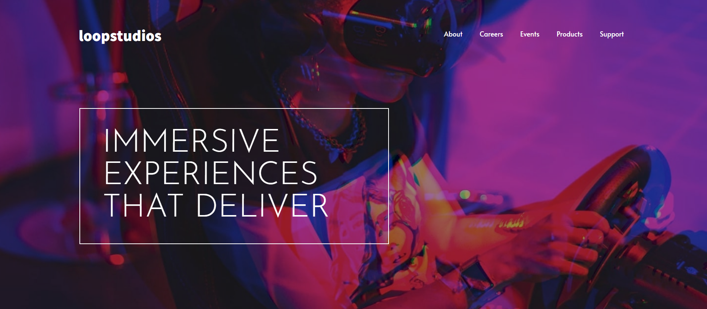
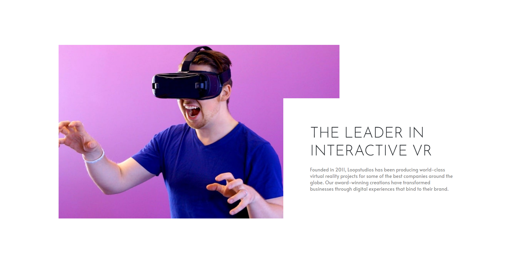
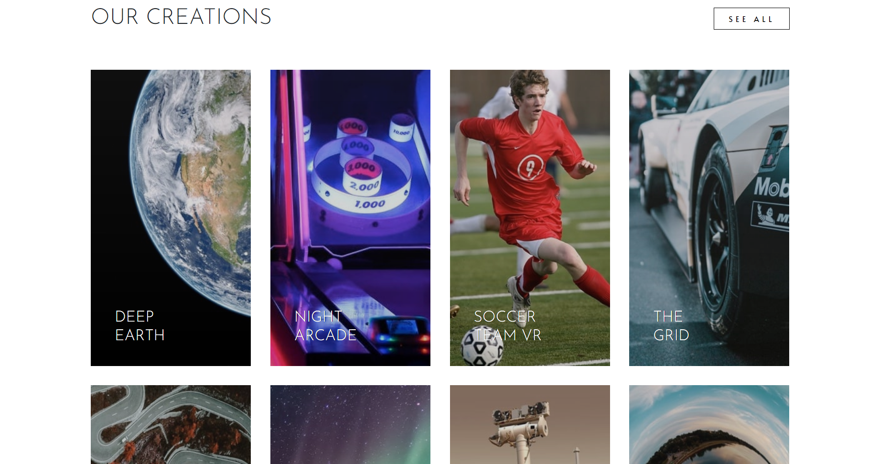

# Frontend Mentor - Loopstudios landing page solution

This is a solution to the [Loopstudios landing page challenge on Frontend Mentor](https://www.frontendmentor.io/challenges/loopstudios-landing-page-N88J5Onjw). Frontend Mentor challenges help you improve your coding skills by building realistic projects. 

## Table of contents

- [Overview](#overview)
  - [The challenge](#the-challenge)
  - [Screenshot](#screenshot)
  - [Links](#links)
- [My process](#my-process)
  - [Built with](#built-with)
- [Author](#author)

## Overview

### The challenge

Users should be able to:

- View the optimal layout for the site depending on their device's screen size. NOTE: Its not responsive. Its only the desktop version.
- See hover states for all interactive elements on the page

### Screenshot

### Links

- Solution URL: [Frontend mentor solution](https://www.frontendmentor.io/solutions/loopstudios-landing-page-BDKIaZAONy)
- Live Site URL: [Github project page](https://manugil22.github.io/loopstudios-landing-page/)

## My process

### Built with

- Semantic HTML5 markup
- CSS custom properties
- Flexbox
- Grid
- [React](https://reactjs.org/) - JS library

## Author

- Frontend Mentor - [@ManuGil22](https://www.frontendmentor.io/profile/ManuGil22)

